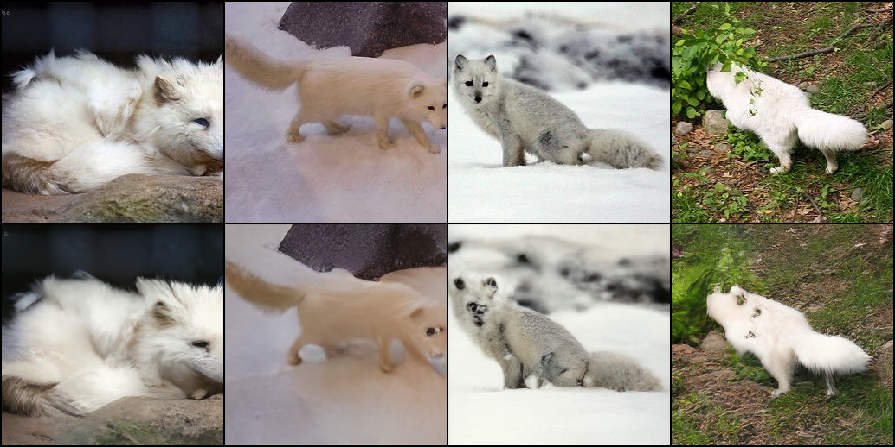

# Efficient VQGAN

## Overview
This repository contains a **non-official** PyTorch implementation of the Efficient VQGAN model from CVPR 2023. The implementation follows the paper's architecture but is independently developed. In addition, the presented code mainly was focused on Stage 1 training (efficient VQ-GAN reconstruction).

### Training Status and Performance Note
The current pretrained model was trained for 25 epochs on ImageNet 2017. However, the achieved performance does not match the results reported in the original paper. While the model exhibits reasonable reconstruction performance, it falls short of the benchmark metrics in the paper. Therefore, layer modifications, additional training, and hyperparameter tuning may be required.

## Paper Architecture

The Efficient VQGAN consists of two main stages:

### Stage 1: Efficient VQ-GAN (Vector Quantized GAN)
- **Encoder**: Compresses input images into latent representations using Swin Transformer blocks
- **Vector Quantization**: Maps continuous latent codes to discrete codebook entries using EMA-based codebook
- **Decoder**: Reconstructs images from quantized latent codes using Swin Transformer blocks with patch expansion
- **Training**: Uses reconstruction loss, perceptual loss (LPIPS), and adversarial loss with projected discriminator

### Stage 2: Multi-grained Transformer
- **Local-Global Architecture**: Combines local window tokens with global block tokens
- **Masked Autoencoding**: Trains with masked token prediction (MAE-style)
- **Autoregressive Sampling**: Generates images block-by-block in an autoregressive manner
- **Training**: Uses bidirectional transformer for masked token reconstruction

## Project Structure

```
├── efficient_vqgan.py          # Stage 1: VQ-GAN model (Encoder, Decoder, Codebook)
├── transformer.py              # Stage 2: Multi-grained Transformer
├── swin_transformer.py         # Swin Transformer building blocks
├── training_vqgan.py           # Stage 1 training script
├── training_transformer.py     # Stage 2 training script
├── inference_reconstruction.py # Image reconstruction inference
├── sample_transformer.py       # Stage 2 image generation sampling
├── lpips.py                    # LPIPS perceptual loss
├── utils.py                    # Utility functions (data loading, checkpoint)
├── example/                    # Inference example
│   └── inference_example.ipynb # Interactive inference examples
├── checkpoints/                # Model checkpoints
│   └── conv3_last.pt           # Pretrained checkpoint
├── data/                       # Dataset directory
├── pg_modules/                 # Projected discriminator modules
│   ├── discriminator.py        # Projected discriminator
│   ├── blocks.py               # Discriminator building blocks
│   ├── diffaug.py              # Differential augmentation
│   └── projector.py            # Feature projection
├── kernels/                    # Processing kernels 
│   └── window_process/         # Window processing kernels
├── reconstruction_results/     # Output directory for reconstructions
└── results/                    # Training results and samples
```

## Pretrained Model
A pretrained Stage 1 model (.pt file) is available in Google Drive. It was pretrained with ImageNet 2017 dataset for 25 epochs (see performance note above).

You can access it here: [Download from Google Drive](https://drive.google.com/file/d/1bLg3gEa7HHzmSzxZkliw7n-pKIcM6PKm/view?usp=sharing)

## Sample Results

Note: This is an inference sample from non-training dataset (256 × 256 × 3). Top are original images, bottom are reconstructed images.



## References
- Original Paper: *Efficient-VQGAN: Towards High-Resolution Image Generation with Efficient Vision Transformers* (CVPR 2023)
- This is an unofficial implementation and may differ from the original paper in some details.

